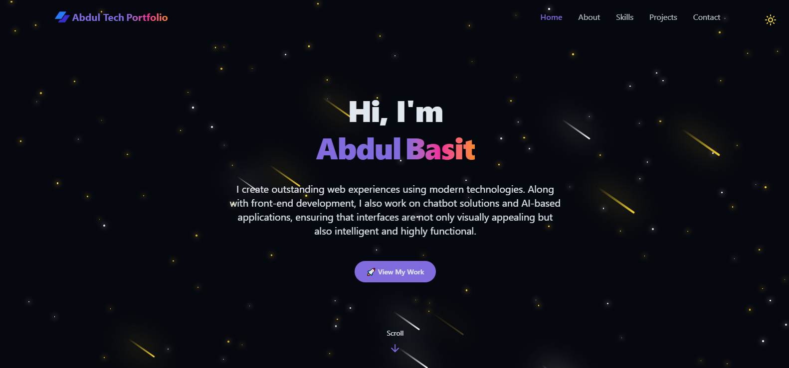

# 🚀 Abdul Basit | Tech Portfolio  

  
*(👆 Replace this with a real screenshot of your portfolio UI — save it as `public/preview.png` and it will show on GitHub automatically.)*  

This is my personal **portfolio website** built with [Next.js](https://nextjs.org), showcasing my **projects, skills, and experience** as a **Full-Stack Developer & Data Scientist**.  
The project is styled with **Tailwind CSS**, enhanced with **Framer Motion**, and connected with **Sanity CMS** for content management.  

---

## 🛠 Tech Stack  

  
  
  
  
  
  
  

- **Framework**: [Next.js 15](https://nextjs.org) (App Router)  
- **Languages**: TypeScript, JavaScript (ES6+)  
- **Styling**: Tailwind CSS, Styled Components, Tailwind Merge  
- **UI Components**: Radix UI, Lucide Icons, Sanity UI  
- **CMS**: [Sanity](https://www.sanity.io/)  
- **Animation**: Motion (Framer Motion-compatible)  
- **Slider**: Keen Slider  
- **Other Tools**: ESLint, PostCSS  

---

## 🌐 Deployment  

Easiest way to deploy is via [Vercel](https://vercel.com):  

```bash
npm run build
npm start
```

Live Demo: [your-portfolio-link.vercel.app](https://your-portfolio-link.vercel.app)  

---

## ✨ Features  

- 🎨 Modern, responsive UI with Tailwind CSS  
- 🔥 Smooth animations with Motion  
- 📰 Dynamic content via Sanity CMS  
- 🖼 Optimized images with Next.js Image  
- ⚡ SEO-friendly metadata setup  
- 🚀 Deployed on Vercel  

---

## 📂 Project Structure  

```bash
app/              # Next.js App Router pages and layouts
components/       # Reusable UI components
sanity/           # Sanity CMS configuration
styles/           # Global styles and Tailwind setup
public/           # Static assets (images, icons, preview screenshots)
```

---

## 📬 Contact  

If you’d like to collaborate or hire me:  

- 🌐 Portfolio: [your-portfolio-link.com](https://your-portfolio-link.com)  
- 💼 LinkedIn: [linkedin.com/in/abdulbasit-codes/](https://www.linkedin.com/in/abdulbasit-codes/)  
- 🐙 GitHub: [github.com/abdud099](https://github.com/abdud099)  
- ✉️ Email: abdud099@gmail.com  
